# Naila Srivastava
**Bioinformatician · Genomics & Pipelines**

MSc Bioinformatics & Systems Biology · University of Manchester 🇬🇧

*Scaling Genomic Discovery through Engineering*

  
---

## 🧬 About Me

I didn't choose bioinformatics because it was easy; I chose it because it sits at the intersection of two things I find endlessly fascinating: the complexity of biology and the precision of computation.

I specialise in building **reproducible, high-throughput genomics pipelines** for NGS, single-cell, rare disease, and cancer genomics, bridging large-scale data engineering with biological discovery. Currently leading analytics pipeline design at Talentlo while continuing to build open-source bioinformatics tooling.

---

## 🛠️ Skills & Stack

### 🧬 Bioinformatics & Pipeline Engineering

**Languages**

**Pipeline & Cloud**

**Libraries & Frameworks**

**NGS Tools**

**Single-Cell**

**Omics**

### Data Science & Analytics

**ML & Deep Learning**

**Analytics**

**Visualisation**

---

## 📊 GitHub Stats

  

  

---

## ✍️ Writing & Contributions

### 📖 Medium - The Bioinformatics Playbook
Bridging the gap between biology and code through technical blogs and tutorials on workflow automation, data visualisation, and reproducible research practices.

➡️ [Visit My Medium Profile](https://medium.com/@naila.srivastava)

### 📊 Kaggle - Curated Datasets & Notebooks

| Dataset | Stats |
|---|---|
| Drugs, Conditions & Side Effects | 5.5K+ views · 1.2K+ downloads |
| Life Expectancy Analysis | 6K+ views · 1.5K+ downloads |

➡️ [Visit My Kaggle Profile](https://kaggle.com/nailasrivastava)

---

## 🌐 Let's Connect

I'm open to collaborations and research roles in **Bioinformatics, Genomics, Computational Biology, and Precision Medicine**, particularly in rare disease, cancer genomics, or multi-omics integration in the UK/EU.

> *"In a world full of noise, I turn complex biological data into meaningful signals."*

